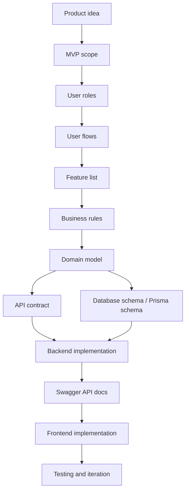

# Project Flow

This file explains the flow we use to move from idea to implementation.

The goal is to make the process reusable for future full-stack projects.

## Full Flow



## Step Meanings

### Product Idea

Define what the product is, who uses it, and what problem it solves.

Example:

```txt
A mini lending platform where customers apply for loans and admins review applications.
```

### MVP Scope

Decide the smallest useful version of the product.

This prevents the first version from becoming too large.

### User Roles

Define who uses the system.

Example:

```txt
CUSTOMER
ADMIN
```

### User Flows

Define what each role does step by step.

Example:

```txt
Customer registers -> creates draft loan application -> adds collateral -> submits application
```

### Feature List

Convert user flows into product capabilities.

Example:

```txt
Auth
Loan application stepper
Collateral management
Admin review
Installment generation
```

### Business Rules

Define what the system allows, blocks, or does automatically.

Example:

```txt
Customer cannot submit a loan application without collateral.
```

Business rules should be enforced by the backend.

### Domain Model

Define the important business objects and relationships.

Example:

```txt
User
LoanApplication
Collateral
Installment
Payment
AuditLog
```

### API Contract

Define how the frontend and backend communicate.

Example:

```txt
POST /auth/login
POST /loans/:id/submit
POST /admin/loans/:id/approve
```

### Database / Prisma Schema

Translate the domain model into database models, fields, relations, constraints, and indexes.

Example:

```txt
User has many LoanApplication records.
LoanApplication has many Installment records.
```

### Backend Implementation

Implement the backend modules, controllers, services, DTOs, guards, Prisma access, and business rules.

### Swagger API Docs

Expose and test the API contract through Swagger.

Example:

```txt
/api/docs
```

### Frontend Implementation

Build the UI and connect it to the backend API.

### Testing And Iteration

Test the full flow, fix issues, and improve features.

## Why This Order Helps

This order prevents random CRUD development.

Each technical decision is connected to a product need:

```txt
User flow -> feature -> rule -> entity -> API -> database -> code
```

For example:

```txt
Customer submits application
-> Submit feature
-> Must have collateral rule
-> LoanApplication + Collateral entities
-> POST /loans/:id/submit
-> LoanApplication and Collateral tables
-> LoansService.submit()
```
